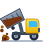
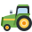
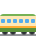
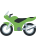
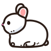
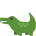
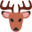
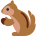

# 🔍 文字あつめ 問題・画像・答え レビュー一覧

「うごく！文字あつめ」ゲームに登場する全73問の**問題画像**、**答えの文字**、**出題問題文**のレビュー用ページです。

> [!TIP]
> 🎧 **音声試聴・絞り込み・メモ保存ができる動的レビューツール**:  
> ブラウザで [`review.html`](review.html) を開くと、出題音声や正解音声の試聴、カテゴリ・文字数フィルタ、チェック状態の保存が可能です。

## 📊 サマリー

| カテゴリ | 問題数 | 文字数の範囲 |
| :--- | :---: | :--- |
| 🚗 のりもの | 23問 | 2文字 〜 8文字 |
| 🦁 どうぶつ | 30問 | 2文字 〜 4文字 |
| 🍎 たべもの | 20問 | 2文字 〜 4文字 |
| **合計** | **73問** | 2文字 〜 8文字 |

### 目次
- [🚗 のりもの (全23問)](#-のりもの-全23問)
- [🦁 どうぶつ (全30問)](#-どうぶつ-全30問)
- [🍎 たべもの (全20問)](#-たべもの-全20問)

## 🚗 のりもの (全23問)

| No | 画像 | 答えの文字 (ひらがな / カタカナ) | 出題問題文 (`questionText`) | 構成文字スロット | 音声・演出テキスト | ID |
| :---: | :---: | :--- | :--- | :--- | :--- | :---: |
| 1 |  | <strong style="font-size:1.1em;">しょうぼうしゃ</strong> <code>ショウボウシャ</code> (7文字) | ウ〜カンカン！火をけす この くるまは？ | `し` `ょ` `う` `ぼ` `う` `し` `ゃ` | 💦 ウ〜カンカン！放水！ <small style="color:#888;">(動作: zoom-dash)</small> | <code>shobo</code> |
| 2 |  | <strong style="font-size:1.1em;">ぱとかー</strong> <code>パトカー</code> (4文字) | パトロールしゅっぱつ！この くるまは？ | `ぱ` `と` `か` `ー` | 🚨 ウ〜〜！パトロール！ <small style="color:#888;">(動作: zoom-dash)</small> | <code>patoka</code> |
| 3 |  | <strong style="font-size:1.1em;">きゅうきゅうしゃ</strong> <code>キュウキュウシャ</code> (8文字) | ピーポーピーポー！病院へ急ぐ この くるまは？ | `き` `ゅ` `う` `き` `ゅ` `う` `し` `ゃ` | 🩹 ピーポーピーポー！ <small style="color:#888;">(動作: zoom-dash)</small> | <code>kyukyusha</code> |
| 4 |  | <strong style="font-size:1.1em;">ばす</strong> <code>バス</code> (2文字) | ぷっぷー！みんなを乗せる この くるまは？ | `ば` `す` | 🚏 ぷっぷー！乗ってね！ <small style="color:#888;">(動作: dance-butt)</small> | <code>basu</code> |
| 5 |  | <strong style="font-size:1.1em;">たくしー</strong> <code>タクシー</code> (4文字) | どこへ行きますか？この くるまは？ | `た` `く` `し` `ー` | 🚖 どこへ行きますか？ <small style="color:#888;">(動作: zoom-dash)</small> | <code>takushi</code> |
| 6 |  | <strong style="font-size:1.1em;">とらっく</strong> <code>トラック</code> (4文字) | お荷物をいっぱい積んで運ぶ この くるまは？ | `と` `ら` `っ` `く` | 📦 荷物を運ぶよ！ <small style="color:#888;">(動作: zoom-dash)</small> | <code>torakku</code> |
| 7 |  | <strong style="font-size:1.1em;">だんぷかー</strong> <code>ダンプカー</code> (5文字) | 荷台を上げて土をザーッと落とす この くるまは？ | `だ` `ん` `ぷ` `か` `ー` | 🪨 荷台がガッターン！土をザーッ！ <small style="color:#888;">(動作: dance-butt)</small> | <code>danpu</code> |
| 8 |  | <strong style="font-size:1.1em;">とらくたー</strong> <code>トラクター</code> (5文字) | 畑をたがやす 力持ちの この くるまは？ | `と` `ら` `く` `た` `ー` | 🌾 畑をたがやすよ！ <small style="color:#888;">(動作: dance-butt)</small> | <code>torakuta</code> |
| 9 |  | <strong style="font-size:1.1em;">くれーんしゃ</strong> <code>クレーンシャ</code> (6文字) | 重いものを高く持ち上げる この 工事の くるまは？ | `く` `れ` `ー` `ん` `し` `ゃ` | 🧱 ウィーン！たかーく持ち上げるよ！ <small style="color:#888;">(動作: super-jump)</small> | <code>kuren</code> |
| 10 |  | <strong style="font-size:1.1em;">きしゃ</strong> <code>キシャ</code> (3文字) | シュッシュッポッポー！煙を出す この 乗り物は？ | `き` `し` `ゃ` | 💨 シュッシュッポッポー！ <small style="color:#888;">(動作: zoom-dash)</small> | <code>kisha</code> |
| 11 |  | <strong style="font-size:1.1em;">でんしゃ</strong> <code>デンシャ</code> (4文字) | 線路をガタゴト走る この 乗り物は？ | `で` `ん` `し` `ゃ` | 🛤️ ガタゴトガタゴト！ <small style="color:#888;">(動作: zoom-dash)</small> | <code>densha</code> |
| 12 |  | <strong style="font-size:1.1em;">ひこうき</strong> <code>ヒコウキ</code> (4文字) | お空をビュイーーッ！この 乗り物は？ | `ひ` `こ` `う` `き` | ☁️ ビュイーーーッ！ <small style="color:#888;">(動作: zoom-dash)</small> | <code>hikoki</code> |
| 13 |  | <strong style="font-size:1.1em;">へり</strong> <code>ヘリ</code> (2文字) | プロペラパタパタ！この 乗り物は？ | `へ` `り` | 🌤️ パタパタ空をとぶ！ <small style="color:#888;">(動作: high-jump)</small> | <code>heri</code> |
| 14 |  | <strong style="font-size:1.1em;">ろけっと</strong> <code>ロケット</code> (4文字) | ３・２・１発射！宇宙へ行く この 乗り物は？ | `ろ` `け` `っ` `と` | ⭐ ３・２・１発射！ <small style="color:#888;">(動作: super-jump)</small> | <code>roketto</code> |
| 15 |  | <strong style="font-size:1.1em;">ふね</strong> <code>フネ</code> (2文字) | ボォーーッ！海をスイスイ進む この 乗り物は？ | `ふ` `ね` | ⚓ ボォーーッ！波スイスイ！ <small style="color:#888;">(動作: dance-butt)</small> | <code>fune</code> |
| 16 |  | <strong style="font-size:1.1em;">ぼーと</strong> <code>ボート</code> (3文字) | 波をビュンビュン走る この 乗り物は？ | `ぼ` `ー` `と` | 🌊 びゅんびゅん走る！ <small style="color:#888;">(動作: zoom-dash)</small> | <code>boto</code> |
| 17 |  | <strong style="font-size:1.1em;">よっと</strong> <code>ヨット</code> (3文字) | 風をうけてスイスイ進む この 乗り物は？ | `よ` `っ` `と` | 🌬️ 風にのってスイスイ！ <small style="color:#888;">(動作: dance-butt)</small> | <code>yotto</code> |
| 18 |  | <strong style="font-size:1.1em;">ばいく</strong> <code>バイク</code> (3文字) | ブルルン！２つのタイヤの この 乗り物は？ | `ば` `い` `く` | 🏁 ブルルン！はやい！ <small style="color:#888;">(動作: zoom-dash)</small> | <code>baiku</code> |
| 19 |  | <strong style="font-size:1.1em;">くるま</strong> <code>クルマ</code> (3文字) | タイヤが４つで ブーーンと走る この 乗り物は？ | `く` `る` `ま` | 🚦 ブーーン！ドライブ！ <small style="color:#888;">(動作: zoom-dash)</small> | <code>kuruma</code> |
| 20 |  | <strong style="font-size:1.1em;">そり</strong> <code>ソリ</code> (2文字) | 雪の上をシューッ！この 乗り物は？ | `そ` `り` | ❄️ 雪の上をシューッ！ <small style="color:#888;">(動作: zoom-dash)</small> | <code>sori</code> |
| 21 |  | <strong style="font-size:1.1em;">じてんしゃ</strong> <code>ジテンシャ</code> (5文字) | チリンチリン！ペダルをこぐ この 乗り物は？ | `じ` `て` `ん` `し` `ゃ` | 🔔 チリンチリン！ <small style="color:#888;">(動作: zoom-dash)</small> | <code>jitensha</code> |
| 22 |  | <strong style="font-size:1.1em;">しんかんせん</strong> <code>シンカンセン</code> (6文字) | 白くて速い！線路をビュンビュン走る この 乗り物は？ | `し` `ん` `か` `ん` `せ` `ん` | 🚄 新幹線ビュイーン！ <small style="color:#888;">(動作: zoom-dash)</small> | <code>shinkansen</code> |
| 23 |  | <strong style="font-size:1.1em;">ききゅう</strong> <code>キキュウ</code> (4文字) | ふわふわお空をとぶ この 乗り物は？ | `き` `き` `ゅ` `う` | ☁️ ふわふわ空をとぶ！ <small style="color:#888;">(動作: high-jump)</small> | <code>kikyu</code> |

## 🦁 どうぶつ (全30問)

| No | 画像 | 答えの文字 (ひらがな / カタカナ) | 出題問題文 (`questionText`) | 構成文字スロット | 音声・演出テキスト | ID |
| :---: | :---: | :--- | :--- | :--- | :--- | :---: |
| 24 |  | <strong style="font-size:1.1em;">ぶた</strong> <code>ブタ</code> (2文字) | ブヒブヒお鼻の この どうぶつは？ | `ぶ` `た` | 🌸 ブヒブヒ〜♪ <small style="color:#888;">(動作: dance-butt)</small> | <code>buta</code> |
| 25 |  | <strong style="font-size:1.1em;">いぬ</strong> <code>イヌ</code> (2文字) | ワンワンほえるよ！この どうぶつは？ | `い` `ぬ` | 🦴 ワンワン！ <small style="color:#888;">(動作: super-jump)</small> | <code>inu</code> |
| 26 |  | <strong style="font-size:1.1em;">ねこ</strong> <code>ネコ</code> (2文字) | ニャオ〜ンと鳴く この どうぶつは？ | `ね` `こ` | 🐟 ニャオ〜ン♪ <small style="color:#888;">(動作: spin)</small> | <code>neko</code> |
| 27 |  | <strong style="font-size:1.1em;">うし</strong> <code>ウシ</code> (2文字) | モ〜〜！ミルクをくれる この どうぶつは？ | `う` `し` | 🥛 モ〜〜〜ッ！ <small style="color:#888;">(動作: dance-butt)</small> | <code>ushi</code> |
| 28 |  | <strong style="font-size:1.1em;">かえる</strong> <code>カエル</code> (3文字) | ケロケロピョンピョン！この 生き物は？ | `か` `え` `る` | 💧 ケロケロ〜！ <small style="color:#888;">(動作: high-jump)</small> | <code>kaeru</code> |
| 29 |  | <strong style="font-size:1.1em;">ぱんだ</strong> <code>パンダ</code> (3文字) | 白黒もようで笹モグモグ！この どうぶつは？ | `ぱ` `ん` `だ` | 🎋 笹おいしいな〜 <small style="color:#888;">(動作: dance-butt)</small> | <code>panda</code> |
| 30 |  | <strong style="font-size:1.1em;">らいおん</strong> <code>ライオン</code> (4文字) | ガオ〜〜！たてがみが かっこいい この どうぶつは？ | `ら` `い` `お` `ん` | 👑 ガオオオーッ！ <small style="color:#888;">(動作: super-jump)</small> | <code>lion</code> |
| 31 |  | <strong style="font-size:1.1em;">とら</strong> <code>トラ</code> (2文字) | かっこいいシマシマ！強い この どうぶつは？ | `と` `ら` | 🐾 ガオッ！しましま！ <small style="color:#888;">(動作: super-jump)</small> | <code>tora</code> |
| 32 |  | <strong style="font-size:1.1em;">ぞう</strong> <code>ゾウ</code> (2文字) | お鼻がながーい！この どうぶつは？ | `ぞ` `う` | 🎪 パオオーーン！ <small style="color:#888;">(動作: super-jump)</small> | <code>zou</code> |
| 33 |  | <strong style="font-size:1.1em;">さる</strong> <code>サル</code> (2文字) | ウキキキッ！バナナが大好きな この どうぶつは？ | `さ` `る` | 🍌 ウキキキッ！ <small style="color:#888;">(動作: high-jump)</small> | <code>saru</code> |
| 34 |  | <strong style="font-size:1.1em;">くま</strong> <code>クマ</code> (2文字) | はちみつがだいすき！力持ちの この どうぶつは？ | `く` `ま` | 🍯 クマー！はちみつ！ <small style="color:#888;">(動作: dance-butt)</small> | <code>kuma</code> |
| 35 |  | <strong style="font-size:1.1em;">うさぎ</strong> <code>ウサギ</code> (3文字) | お耳がながくて ピョンピョン！この どうぶつは？ | `う` `さ` `ぎ` | 🥕 ぴょんぴょん！ <small style="color:#888;">(動作: high-jump)</small> | <code>usagi</code> |
| 36 |  | <strong style="font-size:1.1em;">とり</strong> <code>トリ</code> (2文字) | パタパタお空をとぶ この 生き物は？ | `と` `り` | 🌿 ピピッ！パタパタ！ <small style="color:#888;">(動作: high-jump)</small> | <code>tori</code> |
| 37 |  | <strong style="font-size:1.1em;">うま</strong> <code>ウマ</code> (2文字) | ヒヒーン！パッカパッカ走る この どうぶつは？ | `う` `ま` | 🌾 ヒヒーン！パッカパッカ！ <small style="color:#888;">(動作: zoom-dash)</small> | <code>uma</code> |
| 38 |  | <strong style="font-size:1.1em;">きりん</strong> <code>キリン</code> (3文字) | 首が長くて背が高い！この どうぶつは？ | `き` `り` `ん` | 🍃 首がたかーい！ <small style="color:#888;">(動作: super-jump)</small> | <code>kirin</code> |
| 39 |  | <strong style="font-size:1.1em;">わに</strong> <code>ワニ</code> (2文字) | 大きなお口でガブッ！この 生き物は？ | `わ` `に` | 🌊 ガブガブッ！ <small style="color:#888;">(動作: dance-butt)</small> | <code>wani</code> |
| 40 |  | <strong style="font-size:1.1em;">しか</strong> <code>シカ</code> (2文字) | きれいなツノがある この どうぶつは？ | `し` `か` | 🍁 ピョンピョン走る！ <small style="color:#888;">(動作: high-jump)</small> | <code>shika</code> |
| 41 |  | <strong style="font-size:1.1em;">りす</strong> <code>リス</code> (2文字) | どんぐり だいすき！この どうぶつは？ | `り` `す` | 🌰 どんぐりカリカリ！ <small style="color:#888;">(動作: spin)</small> | <code>risu</code> |
| 42 |  | <strong style="font-size:1.1em;">ひつじ</strong> <code>ヒツジ</code> (3文字) | もこもこ毛糸の この どうぶつは？ | `ひ` `つ` `じ` | ☁️ メェ〜〜メェ〜〜 <small style="color:#888;">(動作: dance-butt)</small> | <code>hitsuji</code> |
| 43 |  | <strong style="font-size:1.1em;">やぎ</strong> <code>ヤギ</code> (2文字) | 高いところもピョンピョン！この どうぶつは？ | `や` `ぎ` | 📜 メェ〜！お手紙モグモグ <small style="color:#888;">(動作: jump)</small> | <code>yagi</code> |
| 44 |  | <strong style="font-size:1.1em;">こあら</strong> <code>コアラ</code> (3文字) | ユーカリの木にギューッ！この どうぶつは？ | `こ` `あ` `ら` | 🐨 木にギューッ！ <small style="color:#888;">(動作: dance-butt)</small> | <code>koara</code> |
| 45 |  | <strong style="font-size:1.1em;">ごりら</strong> <code>ゴリラ</code> (3文字) | 胸をトントンたたく！強い この どうぶつは？ | `ご` `り` `ら` | 💪 ウホウホ！ドラミング！ <small style="color:#888;">(動作: super-jump)</small> | <code>gorira</code> |
| 46 |  | <strong style="font-size:1.1em;">さい</strong> <code>サイ</code> (2文字) | 鼻の上に強いツノ！この どうぶつは？ | `さ` `い` | 🛡️ ツノがかっこいい！ <small style="color:#888;">(動作: zoom-dash)</small> | <code>sai</code> |
| 47 |  | <strong style="font-size:1.1em;">かば</strong> <code>カバ</code> (2文字) | 大きなお口をアーン！この どうぶつは？ | `か` `ば` | 💦 大あくび！ア〜ン！ <small style="color:#888;">(動作: dance-butt)</small> | <code>kaba</code> |
| 48 |  | <strong style="font-size:1.1em;">らくだ</strong> <code>ラクダ</code> (3文字) | お背中にコブがある この どうぶつは？ | `ら` `く` `だ` | 🏜️ コブがポコッ！ <small style="color:#888;">(動作: dance-butt)</small> | <code>rakuda</code> |
| 49 |  | <strong style="font-size:1.1em;">きつね</strong> <code>キツネ</code> (3文字) | コンコン！お耳がピン！この どうぶつは？ | `き` `つ` `ね` | 🌾 コンコン♪ <small style="color:#888;">(動作: spin)</small> | <code>kitsune</code> |
| 50 |  | <strong style="font-size:1.1em;">ぺんぎん</strong> <code>ペンギン</code> (4文字) | よちよち歩き！氷の上の この 鳥は？ | `ぺ` `ん` `ぎ` `ん` | 🧊 ヨチヨチ歩き！ <small style="color:#888;">(動作: dance-butt)</small> | <code>penguin</code> |
| 51 |  | <strong style="font-size:1.1em;">いるか</strong> <code>イルカ</code> (3文字) | 海をスイスイ大ジャンプ！この 生き物は？ | `い` `る` `か` | 🌊 キュイ〜ン！ジャンプ！ <small style="color:#888;">(動作: high-jump)</small> | <code>iruka</code> |
| 52 |  | <strong style="font-size:1.1em;">くじら</strong> <code>クジラ</code> (3文字) | 潮をプシューッ！海で一番大きな この 生き物は？ | `く` `じ` `ら` | 💦 プシューッ！潮吹き！ <small style="color:#888;">(動作: super-jump)</small> | <code>kujira</code> |
| 53 |  | <strong style="font-size:1.1em;">さめ</strong> <code>サメ</code> (2文字) | するどい歯でスイスイ！この 生き物は？ | `さ` `め` | 🌊 するどい歯！スイスイ！ <small style="color:#888;">(動作: zoom-dash)</small> | <code>same</code> |

## 🍎 たべもの (全20問)

| No | 画像 | 答えの文字 (ひらがな / カタカナ) | 出題問題文 (`questionText`) | 構成文字スロット | 音声・演出テキスト | ID |
| :---: | :---: | :--- | :--- | :--- | :--- | :---: |
| 54 |  | <strong style="font-size:1.1em;">りんご</strong> <code>リンゴ</code> (3文字) | 赤くて甘くてシャキシャキ！この くだものは？ | `り` `ん` `ご` | 🍏 シャキシャキ甘い！ <small style="color:#888;">(動作: jump)</small> | <code>ringo</code> |
| 55 |  | <strong style="font-size:1.1em;">みかん</strong> <code>ミカン</code> (3文字) | オレンジ色でジューシー！この くだものは？ | `み` `か` `ん` | 🍊 ジューシーおいしい！ <small style="color:#888;">(動作: jump)</small> | <code>mikan</code> |
| 56 |  | <strong style="font-size:1.1em;">ばなな</strong> <code>バナナ</code> (3文字) | 黄色くてあまーい！この くだものは？ | `ば` `な` `な` | 🍌 もぐもぐあまい！ <small style="color:#888;">(動作: dance-butt)</small> | <code>banana</code> |
| 57 |  | <strong style="font-size:1.1em;">すいか</strong> <code>スイカ</code> (3文字) | 緑と黒のしましま！この たべものは？ | `す` `い` `か` | 🍉 夏はすいか！シャキッ！ <small style="color:#888;">(動作: jump)</small> | <code>suika</code> |
| 58 |  | <strong style="font-size:1.1em;">ぶどう</strong> <code>ブドウ</code> (3文字) | 紫のつぶつぶ！この くだものは？ | `ぶ` `ど` `う` | 🍇 つぶつぶジューシー！ <small style="color:#888;">(動作: spin)</small> | <code>budo</code> |
| 59 |  | <strong style="font-size:1.1em;">いちご</strong> <code>イチゴ</code> (3文字) | 赤くてつぶつぶかわいい！この くだものは？ | `い` `ち` `ご` | 🍓 あまくておいしい！ <small style="color:#888;">(動作: jump)</small> | <code>ichigo</code> |
| 60 |  | <strong style="font-size:1.1em;">めろん</strong> <code>メロン</code> (3文字) | あまくてジューシー！みどりの この くだものは？ | `め` `ろ` `ん` | 🍈 あみあみ高級メロン！ <small style="color:#888;">(動作: jump)</small> | <code>meron</code> |
| 61 |  | <strong style="font-size:1.1em;">とまと</strong> <code>トマト</code> (3文字) | 真っ赤でまあるい この お野菜は？ | `と` `ま` `と` | 🍅 真っ赤なトマト！ <small style="color:#888;">(動作: jump)</small> | <code>tomato</code> |
| 62 |  | <strong style="font-size:1.1em;">ぱん</strong> <code>パン</code> (2文字) | 焼きたてふかふか！この たべものは？ | `ぱ` `ん` | 🥐 焼きたてふかふか！ <small style="color:#888;">(動作: jump)</small> | <code>pan</code> |
| 63 |  | <strong style="font-size:1.1em;">けーき</strong> <code>ケーキ</code> (3文字) | お誕生日のあまーい この たべものは？ | `け` `ー` `き` | 🎉 ハッピーバースデー！ <small style="color:#888;">(動作: super-jump)</small> | <code>keki</code> |
| 64 |  | <strong style="font-size:1.1em;">あいす</strong> <code>アイス</code> (3文字) | つめたくておいしい！この おやつは？ | `あ` `い` `す` | 🍦 つめたくておいしい！ <small style="color:#888;">(動作: spin)</small> | <code>aisu</code> |
| 65 |  | <strong style="font-size:1.1em;">ぷりん</strong> <code>プリン</code> (3文字) | ぷるぷるカラメル！この おやつは？ | `ぷ` `り` `ん` | 🍮 ぷるぷるおいしい！ <small style="color:#888;">(動作: dance-butt)</small> | <code>purin</code> |
| 66 |  | <strong style="font-size:1.1em;">あめ</strong> <code>アメ</code> (2文字) | お口でペロペロ！あま〜い この おやつは？ | `あ` `め` | 🍭 あまーいキャンディ！ <small style="color:#888;">(動作: jump)</small> | <code>ame</code> |
| 67 |  | <strong style="font-size:1.1em;">おにぎり</strong> <code>オニギリ</code> (4文字) | さんかく海苔をまいた ぎゅっぎゅっ この ごはんは？ | `お` `に` `ぎ` `り` | 🍙 もぐもぐおいしい！ <small style="color:#888;">(動作: jump)</small> | <code>onigiri</code> |
| 68 |  | <strong style="font-size:1.1em;">すし</strong> <code>スシ</code> (2文字) | へい、おまち！魚をのせた この たべものは？ | `す` `し` | 🍣 へい、おまち！ <small style="color:#888;">(動作: jump)</small> | <code>sushi</code> |
| 69 |  | <strong style="font-size:1.1em;">かれー</strong> <code>カレー</code> (3文字) | お肉や お野菜 ゴロゴロ！ごはんと食べる この ごはんは？ | `か` `れ` `ー` | 🍛 おいしいカレーライス！ <small style="color:#888;">(動作: jump)</small> | <code>kare</code> |
| 70 |  | <strong style="font-size:1.1em;">つき</strong> <code>ツキ</code> (2文字) | 夜のお空でピカピカ！これは なーんだ？ | `つ` `き` | ✨ お月さま、ピカピカ！ <small style="color:#888;">(動作: spin)</small> | <code>tsuki</code> |
| 71 |  | <strong style="font-size:1.1em;">ほし</strong> <code>ホシ</code> (2文字) | 夜のお空できらきら！これは なーんだ？ | `ほ` `し` | 🌟 きらきらお星さま！ <small style="color:#888;">(動作: super-jump)</small> | <code>hoshi</code> |
| 72 |  | <strong style="font-size:1.1em;">にじ</strong> <code>ニジ</code> (2文字) | 雨上がりの空に七色！これは なーんだ？ | `に` `じ` | ☀️ きれいな七色の虹！ <small style="color:#888;">(動作: super-jump)</small> | <code>niji</code> |
| 73 |  | <strong style="font-size:1.1em;">たいよう</strong> <code>タイヨウ</code> (4文字) | お空でポカポカ！これは なーんだ？ | `た` `い` `よ` `う` | ✨ ポカポカお日さま！ <small style="color:#888;">(動作: spin)</small> | <code>taiyo</code> |

